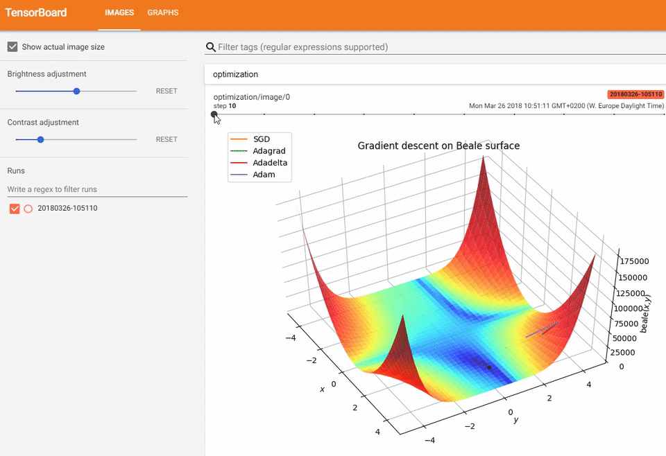
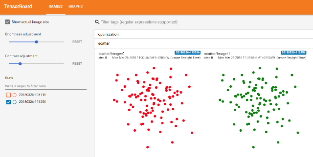
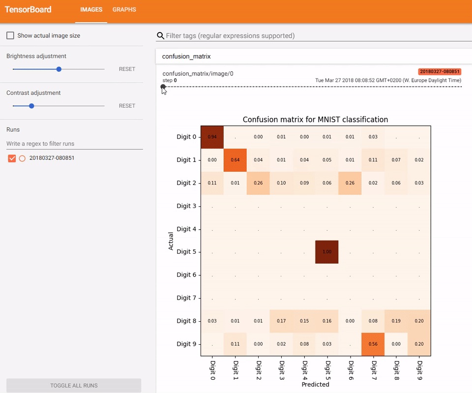

### **tf-matplotlib** - seamless integration of matplotlib figures into TensorFlow summaries

**tf-matplotlib** allows your everyday matplotlib figures to be rendered inside TensorFlow's Tensorboard visualization interface. **tf-matplotlib** 
 - takes care of evaluating input tensors prior to plotting, 
 - avoids matplotlib threading issues
 - support multiple figures and,
 - provides blitting for runtime critical plotting. 
 
The following TensorFlow summary is generated by [sgd.py](tfmpl/samples/sgd.py). It plots the progress of gradient descent optimizers on a test surface. To avoid redrawing the test surface, it makes use of blitting. See [usage](#usage) below for a more introductory example.



### Installation

```
pip install tfmpl
```

Requirements
 - Python 3.5/3.6
 - TensorFlow 1.x
 - matplotlib 2.2.0

### Build status

|Branch|Linux|Windows|
|------|------|------|
|master||  |
|develop|||

### Usage
<a name="usage"></a>

Below are the relevant snippets to render a simple scatter plot. See [scatter.py](tfmpl/samples/scatter.py) for the complete self-contained example.

```python
import tensorflow as tf
import numpy as np

import tfmpl

@tfmpl.figure_tensor
def draw_scatter(scaled, colors): 
    '''Draw scatter plots. One for each color.'''  
    figs = tfmpl.create_figures(len(colors), figsize=(4,4))
    for idx, f in enumerate(figs):
        ax = f.add_subplot(111)
        ax.axis('off')
        ax.scatter(scaled[:, 0], scaled[:, 1], c=colors[idx])
        f.tight_layout()

    return figs

with tf.Session(graph=tf.Graph()) as sess:

    # A point cloud that can be scaled by the user
    points = tf.constant(
        np.random.normal(loc=0.0, scale=1.0, size=(100, 2)).astype(np.float32)
    )
    scale = tf.placeholder(tf.float32)        
    scaled = points*scale

    # Note, `scaled` above is a tensor. Its being passed `draw_scatter` below. 
    # However, when `draw_scatter` is invoked, the tensor will be evaluated and a
    # numpy array representing its content is provided.   
    image_tensor = draw_scatter(scaled, ['r', 'g'])
    image_summary = tf.summary.image('scatter', image_tensor)      
    all_summaries = tf.summary.merge_all() 
    
    writer = tf.summary.FileWriter('log', sess.graph)
    summary = sess.run(all_summaries, feed_dict={scale: 2.})
    writer.add_summary(summary, global_step=0)
```



### Draw utilities

When doing classification, a common task is to generate a confusion matrix. **tf-matplotlib** provides `tfmpl.draw.confusion_matrix` to quickly generate such a plot from labels and predictions. The following plot shows classification training progress on the MNIST classification task. Full sample code is provided in [mnist.py](tfmpl/samples/mnist.py).



### License

```
MIT License

Copyright (c) 2018 Christoph Heindl

Permission is hereby granted, free of charge, to any person obtaining a copy
of this software and associated documentation files (the "Software"), to deal
in the Software without restriction, including without limitation the rights
to use, copy, modify, merge, publish, distribute, sublicense, and/or sell
copies of the Software, and to permit persons to whom the Software is
furnished to do so, subject to the following conditions:

The above copyright notice and this permission notice shall be included in all
copies or substantial portions of the Software.

THE SOFTWARE IS PROVIDED "AS IS", WITHOUT WARRANTY OF ANY KIND, EXPRESS OR
IMPLIED, INCLUDING BUT NOT LIMITED TO THE WARRANTIES OF MERCHANTABILITY,
FITNESS FOR A PARTICULAR PURPOSE AND NONINFRINGEMENT. IN NO EVENT SHALL THE
AUTHORS OR COPYRIGHT HOLDERS BE LIABLE FOR ANY CLAIM, DAMAGES OR OTHER
LIABILITY, WHETHER IN AN ACTION OF CONTRACT, TORT OR OTHERWISE, ARISING FROM,
OUT OF OR IN CONNECTION WITH THE SOFTWARE OR THE USE OR OTHER DEALINGS IN THE
SOFTWARE.
```


